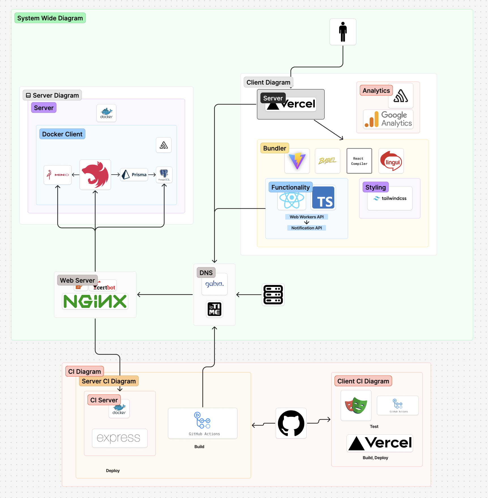

# 요기콕콕!

요기콕콕!의 서버와 클라이언트를 포함한 모노레포형식의 프로젝트입니다. [데모](https://yogi-poke-demo.vercel.app)

## 전체 구조

## 포함된 프로젝트

### client

요기콕콕! 프론트엔드

### server

요기콕콕! 서버

### ci-server

서버에서 실행되는 CI 서버

### web-server

리버스 프록시 서버

### legacy-server

**deprecated**

요기콕콕! 서버 (레거시)
